# Silver Oak Global — Detailed Audit Report

**Site:** https://www.silveroakglobal.com/
**Prepared:** June 2026
**Scope:** Full UX/UI review (desktop + mobile), data & pricing verification against the live market, passive security review, and a best-in-class benchmark.
**Companion:** an interactive version of this report (clickable markers on real screenshots) is hosted separately — this document is the static, printable write-up with the supporting screenshots and the full pricing detail.

---

## 1. Executive summary

Silver Oak Global is a well-stocked, visually rich Dubai real-estate site, but the audit surfaced **93 distinct issues**: a handful are genuinely serious (a blank/again-loading hero, a broken lead pipeline, hardcoded form keys, and three real pricing errors), while most are polish-level UX, content, and consistency problems.

| Severity | Count | Examples |
|---|---|---|
| 🔴 Critical | 12 | Blank hero on load · lead never reaches the CRM · hardcoded Web3Forms keys · 3 pricing errors · only 39 listings live |
| 🟠 High | 27 | Filters can't combine · no sorting · squished images · navbar not sticky · mobile tap targets/fonts |
| 🟡 Medium | 40 | Font inconsistencies · spacing/gutters · placeholder data · review/blog content bugs |
| 🔵 Low | 14 | Old Twitter logo · low-contrast award images · generic alt text |

**The five things to fix first**

1. **Hero loads blank** — the full-screen video has no poster, so the first viewport is a grey block for ~6 s, and the headline is baked into the video (not real text). There is **no visible call-to-action** above the fold. *(A1–A3)*
2. **Leads don't reach the CRM** — forms submit to Web3Forms (email) and land in Gmail, **not** Leadrat. The chatbot says "sent" but nothing arrives in the CRM. *(J2, L2)*
3. **Form access keys are hardcoded in the page** — anyone can read them and inject/spam leads. Proven with a single test submission that reached the inbox. *(L1, L3)*
4. **Three listing prices are wrong** — Diamondz, One by Binghatti, Parkwood (details in §5).
5. **Main content can render blank** — the page ships its content hidden until JavaScript "hydrates" it; on a slow load or a backgrounded tab you see only the header and footer. Reproduced repeatedly during this audit. *(E3, E8)*

---

## 2. Methodology

- **UX/UI:** live inspection of the desktop site and a true 390 px mobile render, with DOM/CSS/layout measurements (not just eyeballing) — e.g. element sizes, computed fonts, scroll heights, sticky/position values, tap-target dimensions.
- **Data & pricing:** every live listing (39 off-plan projects, sitemap-confirmed) cross-checked against the developer's own site and the major portals (Property Finder, Bayut) plus press for the marquee towers.
- **Security:** passive only — reading the shipped client JavaScript, response headers, and publicly reachable endpoints. One authorised test lead was submitted to confirm the pipeline. No exploitation, no backend access.
- **Benchmark:** the best-in-class patterns in §7 were verified against current (2026) live competitor pages.

**Tags used below:** `[measured]` verified via DOM/CSS/network · `[verified]` confirmed via web/data · `[reported]` visual find · `[PoC]` actively proven · `[observed]` seen in capture.

---

## 3. Exhibits (real screenshots)

These are unmodified full-page captures of the live site. In the interactive report each issue is pinned to its exact spot on these same images.

### Exhibit A — Homepage
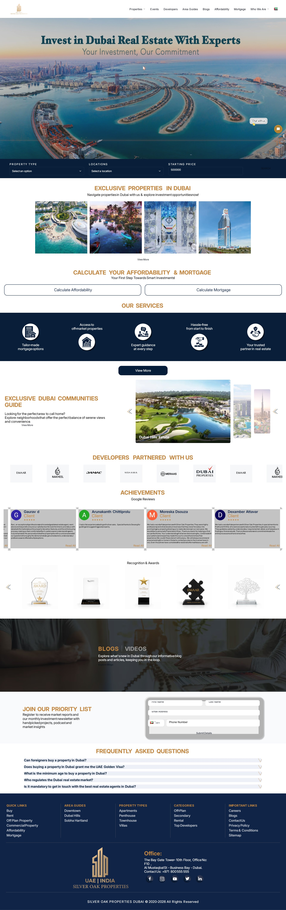

### Exhibit B — Off-plan listings
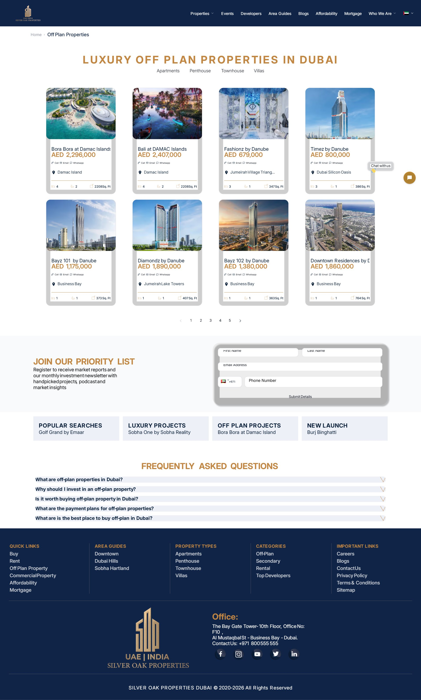

### Exhibit C — Property detail page (Bayz 101 by Danube)
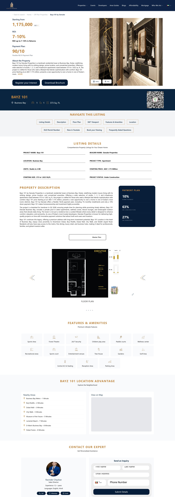

### Exhibit D — Mortgage calculator
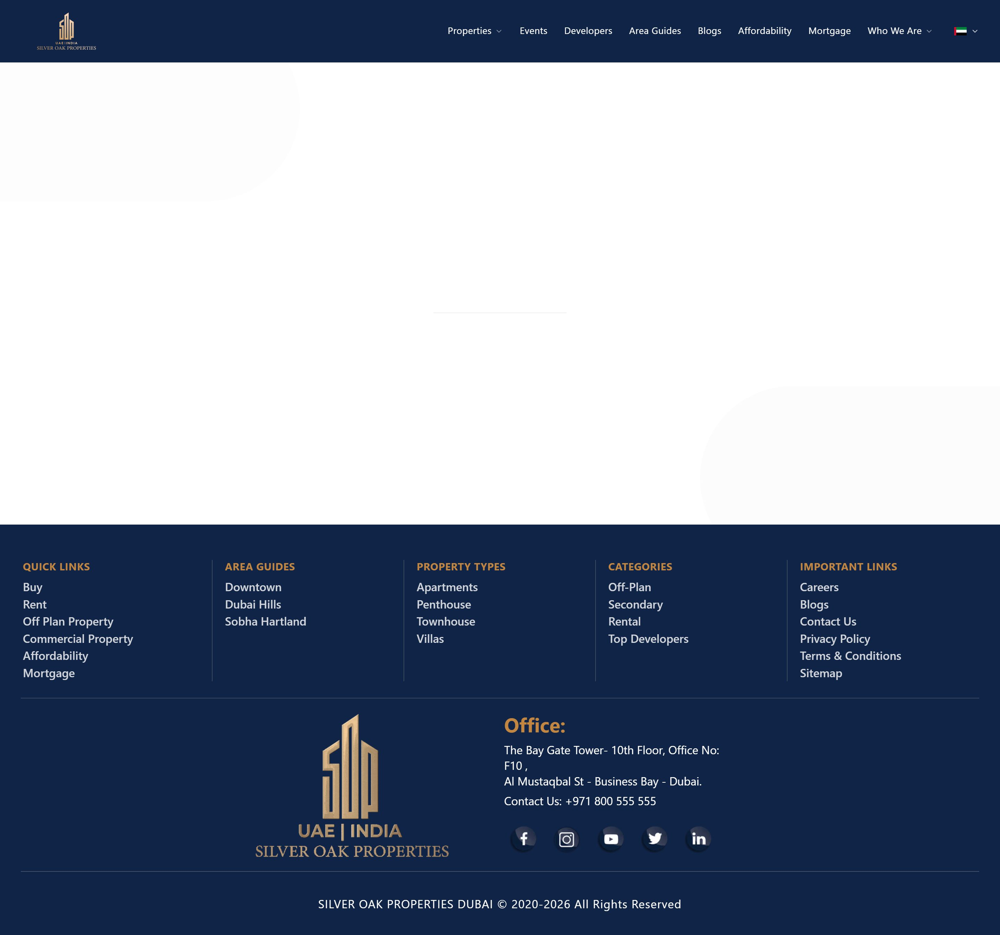

### Exhibit E — Mobile, true 390 px render
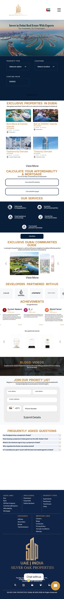

---

## 4. Findings by area

### A. Hero / landing
| # | Sev | Issue |
|---|---|---|
| A1 | 🔴 | Hero `<video>` has **no poster** → ~945 px **blank grey block for 6+ s** on load (`readyState:0`). |
| A2 | 🔴 | Hero **headline + subtext are baked into the video** → blurry, not selectable, no SEO, no a11y, can't edit. |
| A3 | 🔴 | **No visible CTA** in the first viewport — the search bar sits below the fold. |
| A4 | 🟠 | 7.3 MB autoplay MP4, no preload/poster strategy; not reliably autoplaying (`paused:true`). |
| A5 | 🟠 | Header colour doesn't switch to navy properly — broken colour transition. |
| A6 | 🟠 | On returning to home, **header turns white and never reverts** to navy. |
| A7–A8 | 🟡 | Hero headline & subtext fonts don't match the rest of the site. |
| A9 | 🟡 | Logo wordmark too small / low-contrast on navy. |
| A10 | 🟡 | Language/flag selector renders blank then pops in (layout shift). |
| A11–A12 | 🔵 | No loading skeleton; heavy video used where CSS would do. |

**▸ Compare — Hero & search bar.** On a good site the search bar *is* the hero: real HTML text, a Buy/Rent toggle, one clear CTA, no heavy video. Reference: [Property Finder](https://www.propertyfinder.ae/).

| ❌ Silver Oak (the problem) | ✅ Best-in-class — Property Finder |
|---|---|
| 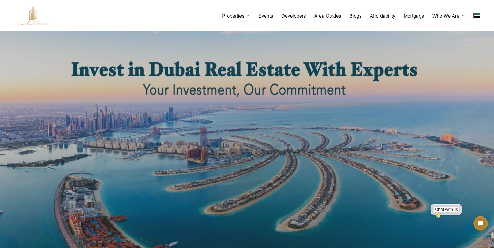 | 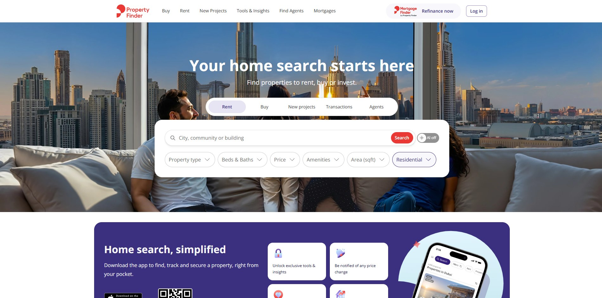 |

### B. Search & filtering
| # | Sev | Issue |
|---|---|---|
| B1 | 🟠 | **Can't combine property type + location** — picking a location drops the type filter. |
| B2 | 🟠 | Search **always defaults to off-plan** — no rent / for-sale toggle. |
| B3 | 🟠 | **No sorting** on listings at all. |
| B4 | 🟠 | Filters very limited — no beds / baths / size / community / status. |
| B5 | 🟡 | "Starting Price" **hardcoded to `500000`** (a value, not a placeholder) — must delete to search lower. |
| B6 | 🟡 | Gold SEARCH button overflows the page width (clipped). |
| B7–B8 | 🟡/🔵 | Filter selectors low-visibility; too few listings to test combinations. |

**▸ Compare — Filters & sorting.** Good sites keep location + type + price + beds/baths combinable in one toolbar, with sorting and no value pre-filled into the price box. Reference: [Property Finder search](https://www.propertyfinder.ae/en/buy/dubai/apartments-for-sale-dubai-marina.html).

| ❌ Silver Oak (the problem) | ✅ Best-in-class — Property Finder |
|---|---|
| 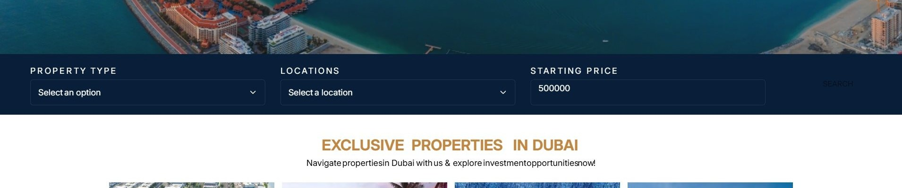 | 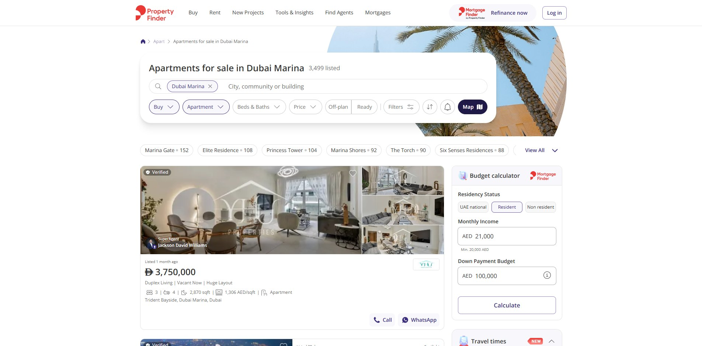 |

### C. Listings & property cards
| # | Sev | Issue |
|---|---|---|
| C1 | 🟠 | Property images **squished** — wrong aspect ratio forced into the placeholder (missing `object-fit`). |
| C2 | 🟠 | Same squishing on the homepage. |
| C3 | 🟡 | Card images low-res / zoomed-in. |
| C4 | 🟡 | Call/Email/WhatsApp shown on every card before opening the property (clutter). |

**▸ Compare — Listing cards.** Price beside a TruCheck "validated on [date]" badge, correctly-proportioned images, and contact actions held back to the detail view. Reference: [Bayut](https://www.bayut.com/for-sale/property/dubai/).

| ❌ Silver Oak (the problem) | ✅ Best-in-class — Bayut |
|---|---|
| 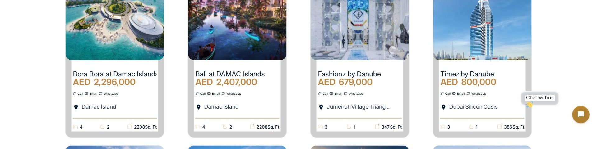 | 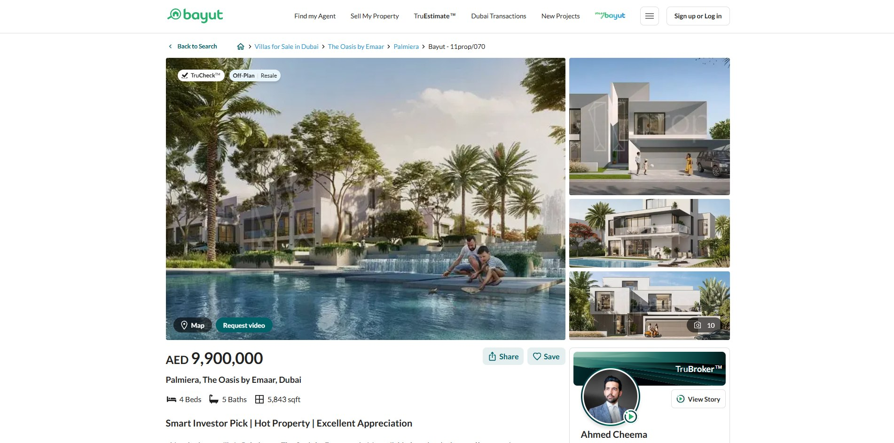 |

**▸ Compare — Property detail page.** Large correctly-proportioned gallery, a prominent price in one number font, scannable beds/baths/area specs, and a clean structured payment plan (no duplicated "ROI up to…" caption). Reference: [Bayut listing](https://www.bayut.com/for-sale/property/dubai/).

| ❌ Silver Oak (the problem) | ✅ Best-in-class — Bayut |
|---|---|
| 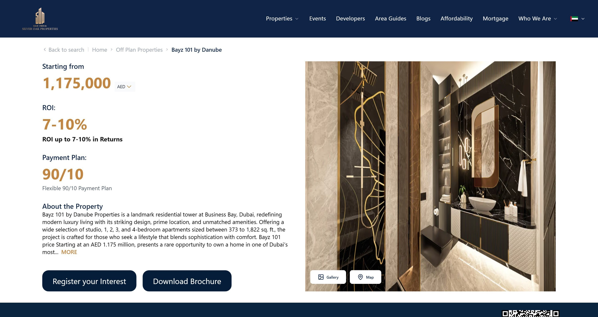 | 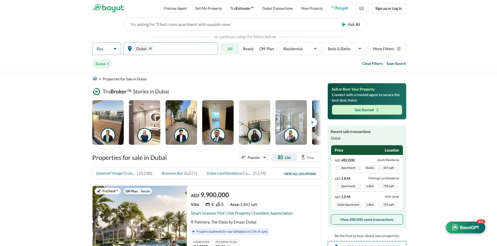 |

### D. Data accuracy & pricing
See the full verification in **§5**. Summary: 32/39 accurate, 4 minor drift, **3 to fix**.

### E. Inventory & content gaps
| # | Sev | Issue |
|---|---|---|
| E1 | 🔴 | **Only 39 off-plan projects live.** `/buy-properties`, `/properties-for-sale-in-dubai`, `/rent-properties` are all **empty**. |
| E2 | 🟠 | Most "Developers Partnered With Us" show **0 properties**. |
| E3 | 🟠 | Homepage **"Exclusive Properties" carousel renders 0 cards** on load (intermittent). |
| E4–E5 | 🟡 | Sharjah/UAQ pages empty; "Exclusive Properties **in Dubai**" actually features Sharjah/UAQ projects. |
| E6–E7 | 🔵 | Developer logos use generic alt ("Developer 1…12"); marquee has inconsistent sizes + duplicated logos. |
| **E8** | 🟠 | **Blank-render reliability bug** — the main content ships inside a wrapper that is `display:none` until client-side hydration swaps it in. While the tab is backgrounded or hydration is slow, users get **only the header + footer shell** (a blank page). Reproduced repeatedly on the detail, mortgage and home pages during this audit. There is **no server-rendered visible fallback**, so any hydration hiccup = a blank page, and crawlers can index an empty shell. *(This is the mechanism behind the "intermittent blank" seen on the detail page and the empty carousel in E3.)* `[measured]` |

### F. Calculators
| # | Sev | Issue |
|---|---|---|
| F1 | 🟠 | Mortgage calc **shows values even when the minimum isn't met** (the affordability calc gates output; this one doesn't). |
| F2 | 🟠 | Interest rate **steps by 0.1 via buttons only** → 3.99%/4.99% impossible. |
| F3 | 🟠 | Interest rate **can't be typed** manually. |
| F4 | 🟡 | Affordability **example income is below 10k AED → ineligible** (bad sample). |
| F5 | 🟡 | "Get Pre-approval" country-code UI issues. |
| F6–F7 | 🔵 | Dead arrows beside the interest-rate and property-price fields. |

**▸ Compare — Mortgage calculator.** Every field is directly typeable *and* on a slider, with sensible bounds (1–25 yr, 1–10%) and a monthly figure that recalculates live — no dead +/− arrows. Reference: [Mortgage Finder](https://www.mortgagefinder.ae/en/calculator).

| ❌ Silver Oak (the problem) | ✅ Best-in-class — Mortgage Finder |
|---|---|
| 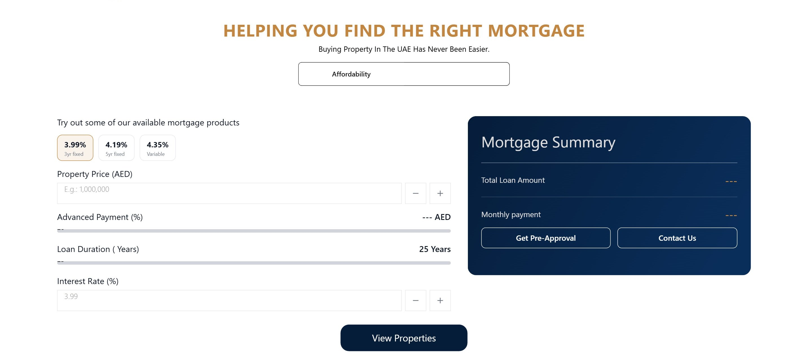 | 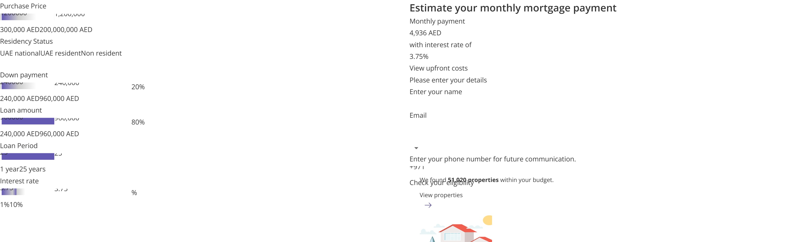 |

### G. Forms & validation
| # | Sev | Issue |
|---|---|---|
| G1 | 🟠 | **No phone validation anywhere** (`type=tel`, `required`, but no `pattern`). |
| G2 | 🟠 | Download-Brochure validation is inaccurate, especially phone. |
| G3 | 🟡 | "Join our priority list" uses a basic country-code selector. |

### H. Content: brochures, blogs, reviews, about
| # | Sev | Issue |
|---|---|---|
| H1 | 🟠 | Brochures are very incomplete. |
| H2 | 🟠 | Review **"Read All" opens a write-a-review page** instead of showing the review. |
| H3 | 🟠 | **Blog cards have no visible titles** (titles exist in markup, not rendered). |
| H4 | 🟡 | **"50+ Specialists"** claimed; team is **37** (overstated; also "18+ yrs / 10+ langs / 4.8"). |
| H5 | 🟡 | **ROI redundant subtext**: shows `ROI: 7-10%` **and** "ROI up to 7-10% in Returns". |
| H6 | 🟡 | Listing-detail subtexts unnecessary/nonsensical. |
| H7–H10 | 🟡/🔵 | Review cards truncate mid-sentence; confusing "Achievements / Google Reviews" labels; low-contrast awards; oversized FAQ text with no sources. |

### I. Typography, layout, spacing
| # | Sev | Issue |
|---|---|---|
| I1 | 🟡 | **Number-font inconsistency** — prices in **Montserrat**, body/stats in **Raleway**. |
| I2 | 🟡 | General lack of font continuity. |
| I3 | 🟡 | **Inconsistent vertical spacing** (10/24/32/48 px + stray margins). |
| I4 | 🟡 | **Inconsistent horizontal gutters** (24–32 px, but 92 px on Affordability, 115 px on FAQ). |
| I5 | 🟠 | **Navbar not sticky** (`position:relative`) on a ~6,344 px page — it scrolls away. |
| I6–I7 | 🔵 | "Our Services" icons zig-zag; priority-list card has a double shadow + large empty gap. |

### J. Components & interaction
| # | Sev | Issue |
|---|---|---|
| J1 | 🔴 | **Chatbot says "unavailable."** |
| J2 | 🔴 | Chatbot **"says sent" but the lead never reaches Leadrat** (lands in Gmail only). |
| J3 | 🟡 | Chat widget **overlaps content** (z-index ~2.1 B, Tidio). |
| J4–J5 | 🟡 | Chatbot named "Hi there 👋" with no avatar; offers "turn off notifications" never enabled. |
| J6 | 🟡 | **Weird hitboxes** on social icons + "Our Services" buttons (clickable area ≠ visible shape). |
| J7 | 🟡 | Expert photos: **heads cut off** (bad `object-position`). |
| J8 | 🟡 | "Who We Are" dropdown opens at the far-right edge (overflow risk). |
| J9 | 🟡 | Properties dropdown mislabeled "Categories" (holds Area Guides + Blogs). |
| J10 | 🔵 | Twitter icon still the **old bird** logo. |

### K. Footer / contact / brand
| # | Sev | Issue |
|---|---|---|
| K1 | 🟠 | The site's only clickable phone link (the phone icon in the slide-in **mobile menu**'s "Contact Us" row) has the placeholder href **`tel:+1234567890`** — tapping it on mobile dials a fake number. The visible footer number `+971 800 555 555` is correct but is plain text, not a link. |
| K2 | 🟡 | Contact email **`info@silveroakglobal.ae`** (`.ae`) on a `.com` site. |
| K3 | 🟡 | Brand uses **3 TLDs** (`.com`/`.ae`/`.in`) inconsistently. |

### L. Security (passive) — see §6.

### M. Mobile (true 390 px render)
| # | Sev | Issue |
|---|---|---|
| M1 | 🟠 | **Tap targets too small** — 104 of 117 interactive elements under 44×44 px (hamburger 28×28, country selector 24 px tall). |
| M2 | 🟠 | **Unreadable tiny fonts** — down to **5–6 px**; 158 text nodes under 12 px (USD/INR price sublines). |
| M3 | 🟠 | **Hero text illegible** — the 16:9 video collapses to a ~219 px strip, so the baked-in headline is tiny/blurry. |
| M4 | 🟡 | Mobile menu repeats the too-small logo and the legacy Twitter bird. |
| M5 | 🟢 | **No horizontal overflow** at 390 px — *verified good, not a flaw.* |

---

## 5. Pricing verification (the detail)

**What's right:** the live off-plan prices are mostly accurate — **32 of 39** match the developer/market starting price, and there is **no gross error** (e.g. the "AED 500,000,000" figure) anywhere in the 39 live listings.

> **Note on the "Palace Residences at Al Mamsha = AED 500,000,000" example:** that project is **not in the current 39 live listings or the sitemap** — it lived only in the homepage "Exclusive Properties" carousel, which currently renders empty (E3). It could not be reproduced; its data source is suspect and should be re-checked.

### 5.1 The three to fix (notable discrepancies)

| Project | Developer | Location | Listed on site | Real market start (online) | Discrepancy |
|---|---|---|---|---|---|
| **Diamondz by Danube** | Danube | JLT | **AED 1,890,000** | **~AED 1,100,000** (studio) | **Overstated ~AED 790,000** — the site shows a higher unit type than the true entry price |
| **One by Binghatti** | Binghatti | Business Bay | **AED 1,111,111** | **~AED 1,699,999** | **Understated ~AED 590,000** — listed well below market start |
| **Parkwood by Emaar** | Emaar | Dubai Hills Estate | **AED 1,450,000** | **~AED 1,750,000** | **Understated ~AED 300,000** |

### 5.2 Minor drift (within normal variance, verify against your CRM)

| Project | Listed | Market | Note |
|---|---|---|---|
| Bayz 102 by Danube | AED 1,380,000 | 1,200,000–1,380,000 | At the high end of the range |
| Azizi Milan 20 | AED 680,000 | ~560,000 | High |
| Sobha Orbis | AED 965,070 | ~985,000 | ~20k low |
| Riverside Crescent 320 | AED 1,200,000 | 1.3M–1.6M | ~100k+ low |

Also a **location data issue (not price):** Azizi Milan 30/20/9 are labelled "Al Furjan," but the Azizi Milan development is in **City of Arabia / Dubailand**.

### 5.3 Full comparison — all 39 live listings

| # | Project | Developer | Location | Listed (AED) | Market start (AED) | Verdict |
|---|---|---|---|---|---|---|
| 1 | Bora Bora at Damac Islands | Damac | Damac Islands | 2,296,000 | ~2,296,000 | ✅ |
| 2 | Bali at DAMAC Islands | Damac | Damac Islands | 2,407,000 | 2,380,000–2,490,000 | ✅ |
| 3 | Fashionz by Danube | Danube | JVT | 679,000 | ~684,000 | ✅ |
| 4 | Timez by Danube | Danube | Dubai Silicon Oasis | 800,000 | ~800,000 | ✅ |
| 5 | Bayz 101 by Danube | Danube | Business Bay | 1,175,000 | 1,155,000–1,175,000 | ✅ |
| 6 | **Diamondz by Danube** | Danube | JLT | **1,890,000** | **~1,100,000** | ⚠️ overstated |
| 7 | Bayz 102 by Danube | Danube | Business Bay | 1,380,000 | 1,200,000–1,380,000 | 🟡 high |
| 8 | Downtown Residences by Deyaar | Deyaar | Business Bay | 1,860,000 | ~1,860,000 | ✅ |
| 9 | Rosehill | Emaar | Dubai Hills Estate | 1,600,000 | ~1,600,888 | ✅ |
| 10 | Azizi Raffi | Azizi | Al Furjan | 685,000 | 658,000–685,000 | ✅ |
| 11 | Azizi Ruby | Azizi | JVC | 601,000 | 596,000–620,000 | ✅ |
| 12 | Azizi Arian | Azizi | Jebel Ali | 569,000 | ~569,000 | ✅ |
| 13 | Binghatti Ghost | Binghatti | Al Jaddaf | 850,000 | ~888,888 | ✅ |
| 14 | **One by Binghatti** | Binghatti | Business Bay | **1,111,111** | **~1,699,999** | ⚠️ understated |
| 15 | Binghatti Aquarise | Binghatti | Business Bay | 999,000 | ~999,999 | ✅ |
| 16 | Samana Ibiza | Samana | Dubailand | 699,000 | ~699,000 | ✅ |
| 17 | Vela Viento | Omniyat | Business Bay | 18,540,000 | 17.5M–18.5M | ✅ |
| 18 | Armani Beach Residences | Arada | Palm Jumeirah | 21,000,000 | 21M–21.5M | ✅ |
| 19 | Palm Beach Tower 3 | Nakheel | Palm Jumeirah | 3,700,000 | ~3,700,000 | ✅ |
| 20 | Burj Azizi | Azizi | Sheikh Zayed Road | 7,500,000 | 7,500,000 | ✅ |
| 21 | Azizi Milan 51 | Azizi | City of Arabia | 581,000 | 550k–586k | ✅ |
| 22 | Azizi Milan 30 | Azizi | Al Furjan* | 650,000 | ~650,000 | ✅ (*loc) |
| 23 | Azizi Milan 20 | Azizi | Al Furjan* | 680,000 | ~560,000 | 🟡 high (*loc) |
| 24 | Azizi Milan 9 | Azizi | Al Furjan* | 750,000 | 550k–950k | ✅ (*loc) |
| 25 | Trussardi Residences | Mira | Al Furjan | 1,400,000 | ~1.4M | ✅ |
| 26 | Park Lane by Emaar | Emaar | Dubai Hills Estate | 1,400,000 | ~1,400,000 | ✅ |
| 27 | **Parkwood by Emaar** | Emaar | Dubai Hills Estate | **1,450,000** | **~1,750,000** | ⚠️ understated |
| 28 | Golf Grand by Emaar | Emaar | Dubai Hills Estate | 1,400,000 | ~1,400,000 | ✅ |
| 29 | Club Place by Emaar | Emaar | Dubai Hills Estate | 1,450,000 | ~1,450,000 | ✅ |
| 30 | Mercedes Benz Places | Binghatti | Downtown | 8,800,000 | 8.8M–10M | ✅ |
| 31 | Bentley Villas (Mira Villas) | Mira | Meydan | 20,000,000 | 20M+ | ✅ |
| 32 | Binghatti Skyrise | Binghatti | Business Bay | 975,000 | ~975,000 | ✅ |
| 33 | Sobha Orbis | Sobha | Motor City | 965,070 | ~985,000 | 🟡 low |
| 34 | Sobha Solis | Sobha | Motor City | 1,070,000 | 1.01M–1.07M | ✅ |
| 35 | Sobha Seahaven | Sobha | Dubai Harbour | 3,140,000 | 3.14M–3.18M | ✅ |
| 36 | Eywa | R.Evolution | Business Bay | 10,000,000 | 10M–11.5M | ✅ |
| 37 | Burj Binghatti Jacob & Co | Binghatti | Business Bay | 8,000,000 | ~8,000,000 | ✅ |
| 38 | Sobha One | Sobha | Ras Al Khor | 1,100,000 | 1.1M (1-bed ~1.68M+) | ✅ |
| 39 | Riverside Crescent 320 | Sobha | Sobha Hartland 2 | 1,200,000 | 1.3M–1.6M | 🟡 low |

\* Azizi Milan towers are labelled "Al Furjan" but the development sits in City of Arabia / Dubailand.

**Sources:** developer official sites (emaar.com, sobharealty.com, danubeproperties.com, binghatti.com, miradevelopments.ae, omniyat), Property Finder, Bayut, and press (Khaleej Times / Gulf News for Burj Azizi). Off-plan starting prices legitimately vary by source, unit type, phase, and over time; differences within ~±10% are treated as normal.

---

## 6. Security review (passive)

> Passive review only — reading shipped client JS, response headers, and public endpoints. One authorised test lead was submitted to confirm the pipeline. No exploitation or backend access.

| # | Sev | Issue |
|---|---|---|
| L1 | 🔴 | **Web3Forms access keys hardcoded in client JS** (two UUIDs) + recipient `leads@silveroakglobal.in` exposed → anyone can inject leads / spam / exhaust quota. **Proven** (test lead reached Gmail). |
| L2 | 🔴 | **Forms submit to Web3Forms (email), not Leadrat** — the CRM pipeline is broken. Confirmed (Gmail yes, Leadrat no). |
| L3 | 🔴 | **`to` recipient field appears attacker-controllable** → possible lead-redirect / spam-relay abuse. |
| L4 | 🟠 | **Missing security headers** — no CSP, no X-Frame-Options (clickjacking / framing — which is how the mobile render was even possible), no nosniff, no Referrer-Policy, no Permissions-Policy. |
| L5 | 🟠 | **Public admin/CMS login** at `sop-cms.silveroak.ae` reachable from any IP. |
| L6 | 🟡 | **Internal emails harvestable** in the client bundle (`marketing@`, `info@`, `leads@`). |
| L7 | 🟡 | **Stack/info disclosure** via headers (`x-powered-by: Next.js`, `server: Vercel`, `x-matched-path`). |
| L8 | 🔵 | **Placeholder/sample data in production** (`email@example.com`, `john@gmail.com`, `tel:+1234567890`). |

**Confirmed good:** S3 public listing disabled · HSTS present · CMS data fetched server-side (keys not in the client) · cookies are GA-only · no JS/console errors.

**Recommended fixes:** move form submission server-side (proxy the access key, lock the recipient, add rate-limiting + hCaptcha) and restore the Leadrat integration; add the missing security headers; put the CMS login behind SSO/IP allow-listing; strip placeholder data.

---

## 7. Benchmark summary

The visual side-by-side comparisons (our screenshot vs the best-in-class reference) are shown **beside each area in §4**. This table maps each benchmarked reference to the findings it addresses. (All URLs verified live in 2026; Zillow and Emaar block automated capture, so they're linked rather than screenshotted.)

| Area | Silver Oak gap | Best-in-class reference | Why it's good |
|---|---|---|---|
| **Hero + visible search CTA** | A1–A3 (blank hero, no CTA, baked-in text) | **Property Finder** — https://www.propertyfinder.ae/ · **Rightmove** — https://www.rightmove.co.uk/ | The search bar *is* the hero: front-and-centre on load with a clear Buy/Rent toggle and one dominant CTA; real text, instant paint, no video. |
| **Combinable multi-criteria filters** | B1–B4 (can't combine type+location, no sort, few filters) | **Property Finder** — https://www.propertyfinder.ae/en/buy/dubai/apartments-for-sale-dubai-marina.html | Location + type + price + beds/baths stay visible and combinable in one persistent toolbar; the active filters are encoded in a clean, shareable URL. |
| **Mortgage / affordability calculator** | F1–F7 (untypeable rate, 0.1 steps, dead arrows, shows invalid values) | **Mortgage Finder** — https://www.mortgagefinder.ae/en/calculator · **Zillow** — https://www.zillow.com/mortgage-calculator/house-affordability/ | Every field is directly typeable *and* has a slider, with sensible min/max bounds (1–25 yr, 1–10%) and an instantly recalculating result. |
| **Property detail page** | C1 (squished gallery), I1 (price font), H5/H6 (junk subtext) | **Bayut** — open any listing from https://www.bayut.com/for-sale/property/dubai/ · **Emaar off-plan** — https://www.emaar.com/en/ | Large correctly-proportioned gallery, prominent price, scannable beds/baths/area specs, and an explicit structured payment plan (down payment → milestones → handover). |
| **Trustworthy price on cards** | D1–D3 (price errors), C-cards lack trust cues | **Bayut** — https://www.bayut.com/for-sale/property/dubai/ · **Rightmove** — https://www.rightmove.co.uk/ | Bayut shows the price next to a "TruCheck — validated on [date]" badge tying the price to a verification date; Rightmove honestly labels "Guide Price / POA / Offers Over" so a card never overstates certainty. |
| **Mobile homepage** | M1–M4 (tiny tap targets, 5–6 px fonts, illegible hero) | **Bayut** (view at ~390 px) — https://www.bayut.com/ · **Zillow** — https://www.zillow.com/ | Single-column hero with a large legible search field, thumb-reachable controls, properly sized tap targets, no horizontal scroll. |

---

## 8. Prioritised action plan

**Now (reliability & trust)**
1. Fix the lead pipeline — restore Leadrat, move form submission server-side, lock the recipient, add rate-limiting + captcha (J2, L1–L3).
2. Give the hero a poster image (or static hero), real HTML headline/subtext, and a visible CTA (A1–A3).
3. Fix the blank-render gate — server-render visible content or show a real skeleton, never a `display:none` page (E3, E8).
4. Correct the three prices (Diamondz, One by Binghatti, Parkwood) and re-check the homepage carousel data source (D1–D3, D6).

**Next (core UX)**
5. Make filters combinable + add sorting and beds/baths/size filters; remove the hardcoded `500000` (B1–B5).
6. Fix `object-fit` so card and gallery images stop squishing (C1–C2).
7. Make the navbar sticky; standardise spacing/gutters and the number font (I1–I5).
8. Make the mortgage calculator inputs typeable with proper bounds; remove the dead arrows (F1–F7).
9. Mobile: enforce 44 px tap targets and a 12 px minimum font; fix the hero strip (M1–M3).

**Then (content & polish)**
10. Fill empty inventory pages or hide them; fix blog titles, review "Read All", the "50+ specialists" claim; add the missing security headers; swap the old Twitter logo; tidy placeholder data (E1, H2–H4, K1, L4, L8).

---

*Severity legend: 🔴 Critical · 🟠 High · 🟡 Medium · 🔵 Low · 🟢 verified-good.*
